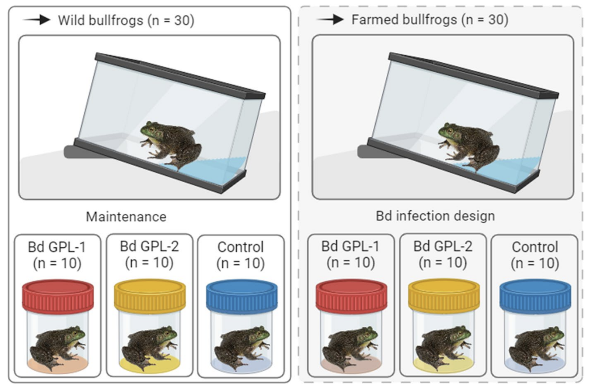

---
title: "Lab news"
---

## July 2026

### 1. New paper out!

::: {.column width="60%"}

::: {.column width="120%"}

In a new study published in [Hydrobiologia](https://doi.org/10.1007/s10750-026-06301-0){target="_blank"}, we show that farmed invasive American bullfrogs have higher *Batrachochytrium dendrobatidis* infection loads and shed more zoospores than their wild counterparts, with important implications for amphibian disease ecology. 

:::

:::

 

### 2. We have a new home!

::: {.column width="60%"}

::: {.column width="120%"}

LaFIDA has just arrived at the [University of São Paulo](https://www5.usp.br/){target="_blank"}

:::

:::