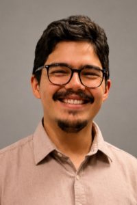

## Principal Investigator

### Danilo Giacometti

Assistant Professor

Department of Physiology, Institute of Biosciences  
Universidade de São Paulo

<a href="https://drive.google.com/file/d/1V_dymIEAEKDlmG0hRskaVD-2oR3SU6LO/view?usp=sharing" target="_blank">
  Download CV
</a> | 
<a href="http://lattes.cnpq.br/7962343589657532" target="_blank">
  Currículo Lattes
</a>

Research interests:

- Thermal biology  
- Hydroregulation  
- Energetics  
- Evolutionary physiology  

---

## Students

- Emilly Q. dos Santos. **Honours thesis**: The impact of seasonality on the maintenance of thermal, energetic, and hydric balance in urban lizards.

- João Victor G. dos Santos. **Honours thesis**: The thermal consequences of behavioural fever in *Tropidurus* lizards.

---

## Collaborators

<ul>
  <li><a href="https://tattersalllab.com/" target="_blank">Dr. Glenn Tattersall</a> — Brock University, Canada</li>
  <li><a href="https://jecarvalho7.wixsite.com/carvalholabunifesp" target="_blank">Dr. José Eduardo de Carvalho</a> — Universidade Federal de São Paulo, Brasil</li>
  <li><a href="https://www.instagram.com/lecofis_uemg/" target="_blank">Dr. Fábio Barros</a> — Universidade do Estado de Minas Gerais, Brasil</li>
  <li><a href="https://sites.usp.br/kohlsdorflab/" target="_blank">Dr. Tiana Kohlsdorf</a> — Universidade de São Paulo, Brasil</li>
  <li><a href="https://evomorfo.ufpr.br/" target="_blank">Dr. Alexandre Palaoro</a> — Universidade Federal do Paraná, Brasil</li>
  <li><a href="https://leemlab.weebly.com" target="_blank">Dr. Laura Leal</a> — Universidade Federal do Paraná, Brasil</li>
  <li><a href="https://www.ib.usp.br/telefones-ib/docentes-ib/64-carlos-arturo-navas-iannini.html" target="_blank">Dr. Carlos Navas</a> — Universidade de São Paulo, Brasil</li>
  <li><a href="https://www.unesp.br/portaldocentes/docentes/156780?lang=pt_BR" target="_blank">Dr. Denis Andrade</a> — Universidade Estadual Paulista "Júlio de Mesquita Filho", Brasil</li>
  <li><a href="https://keniabicegolab.com/" target="_blank">Dr. Kênia Bícego</a> — Universidade Estadual Paulista "Júlio de Mesquita Filho", Brasil</li>
  <li><a href="https://scholar.google.com/citations?user=4WSMITAAAAAJ&hl=en" target="_blank">Dr. Melissa Bars-Closel</a> — Universidade Estadual Paulista "Júlio de Mesquita Filho", Brasil</li>
  <li><a href="https://patrickmoldowan.weebly.com/" target="_blank">Dr. Patrick Moldowan</a> — Mount Allison University, Canada</li>
  
</ul>

